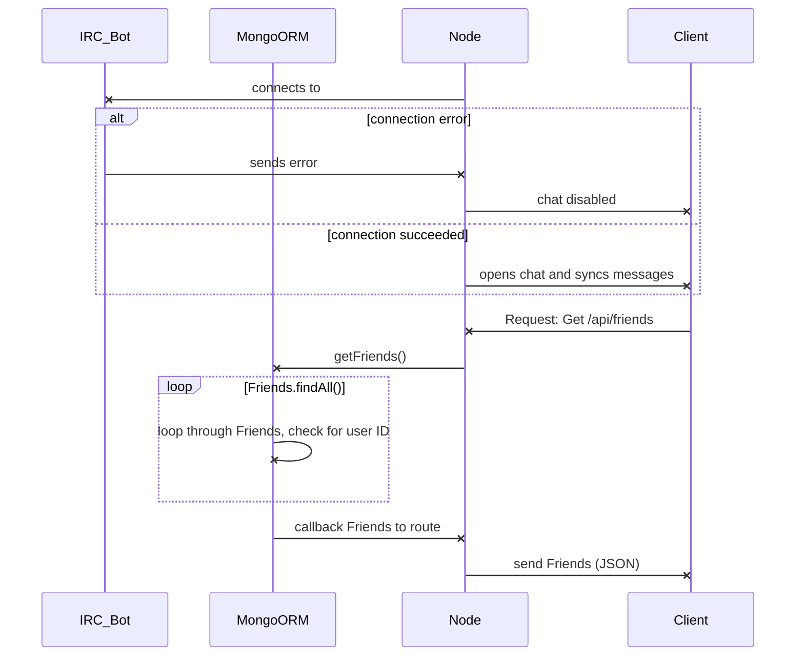

```mermaid
sequenceDiagram
participant IRC_Bot
    participant MongoORM
	participant Node
	Node-xIRC_Bot: connects to 
	alt connection error
		IRC_Bot-xNode: sends error
		Node-xClient:  chat disabled
	else connection succeeded
		Node-xClient: opens chat and syncs messages
	end
	Client-xNode: Request: Get /api/friends
	Node-xMongoORM: getFriends()
    loop Friends.findAll()
	    MongoORM-xMongoORM: loop through Friends, check for user ID
    end
    MongoORM-xNode: callback Friends to route   
    Node-xClient: send Friends (JSON)
  
```